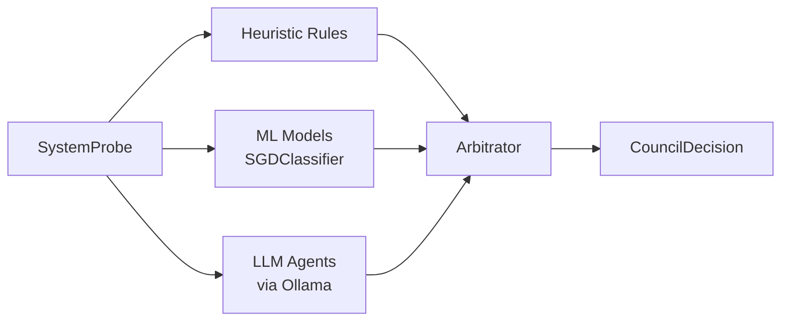
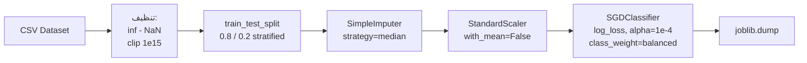
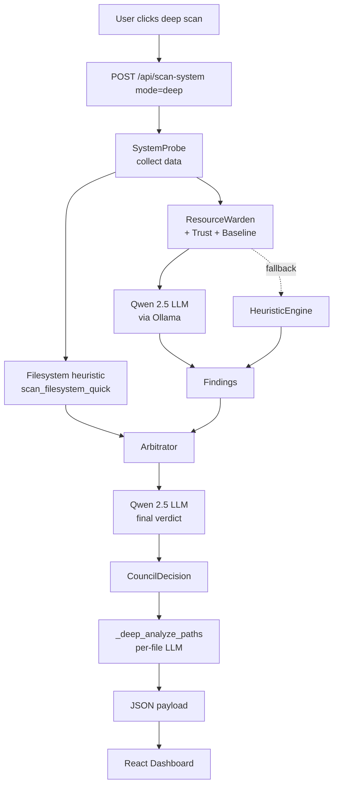

# MODELS & AGENTS — الموديلات، الوكلاء، وبيانات التدريب

هذا المستند يشرح **بيانات التدريب** و**الموديلات** و**وكلاء الذكاء الاصطناعي** المستخدمة في المنصّة، وكيف يتدفّق التحليل من جمع البيانات إلى القرار النهائي.

---

## 1) نظرة عامة

المنصّة تجمع بين **ثلاثة طبقات تحليل** تعمل محلياً (offline):

| الطبقة | الوصف | تستخدم |
| ------ | ----- | ------ |
| Heuristic Rules | قواعد ثابتة (امتدادات، مسارات مشبوهة، أنماط أوامر) | لا تحتاج LLM |
| ML Models | موديلَا scikit-learn مدرّبان على CIC-IDS2018 و CIC-MalMem-2022 | predict سريع |
| LLM Agents | وكلاء (Council + COA + ICS) ينطلقون عبر **Ollama** محلياً | reasoning عميق |



---

## 2) بيانات التدريب (Datasets)

### 2.1 CIC-IDS2018 — تهديدات الشبكة

- **المسار:** [data/datasets/cic_ids2018/02-15-2018.csv](data/datasets/cic_ids2018/02-15-2018.csv)
- **المصدر:** Canadian Institute for Cybersecurity (UNB).
- **الحجم:** 358 MB، عيّنة من يوم `02-15-2018`.
- **الأعمدة:** 79 عموداً (78 ميزة عددية + `Label`).
- **التسمية:** `Label ∈ {Benign, Various Attack Types}` — حُوّلت إلى ثنائية: `is_attack = 1` لأي تسمية ≠ `Benign`.
- **أنواع الهجمات الموجودة:** Bruteforce, DoS, DDoS, Botnet, Infiltration, Web Attacks، إلخ.
- **الميزات (أمثلة):** `Flow Duration`, `Total Fwd Packets`, `Bwd Packet Length Mean`, `Flow Bytes/s`, `Packet Length Variance`, `SYN/FIN/RST Flag Count`، إلخ.

### 2.2 CIC-MalMem-2022 — البرمجيات الخبيثة في الذاكرة

- **المسار:** [data/datasets/cic_malmem/Obfuscated-MalMem2022.csv](data/datasets/cic_malmem/Obfuscated-MalMem2022.csv)
- **المصدر:** Canadian Institute for Cybersecurity.
- **الحجم:** ~58k صف.
- **الأعمدة:** 56 عموداً (55 ميزة عددية + `Category`).
- **التسمية:** `Category ∈ {Benign, Malware-...}` — حُوّلت إلى ثنائية: `is_malware = 1`.
- **العائلات الموجودة:** Ransomware (Conti, Maze, Pysa), Trojan, Spyware (180Solutions, Gator), Backdoor (e.g., Tofsee).
- **الميزات (أمثلة):** عدد العمليات (`pslist.nproc`), DLLs الفريدة (`dlllist.ndlls`), handles, callbacks, ldrmodules غير عاديّة، `malfind` عيّنات حقن، إلخ.

> ملاحظة: ملفات الـ CSV الأصلية كبيرة وتم استثناؤها من Git في [.gitignore](.gitignore). يجب تنزيلها يدوياً ووضعها في المسارات أعلاه.

---

## 3) الموديلات المُدرَّبة (ML Models)

### 3.1 السكربت

[scripts/train_threat_models.py](scripts/train_threat_models.py)

```bash
python scripts/train_threat_models.py \
  --max-rows-cic 250000 \
  --max-rows-malmem  # كل الصفوف
```

### 3.2 خط أنابيب التدريب



### 3.3 الموديلان الناتجان

| الموديل | المسار | الميزات | الصفوف المستخدمة | المهمّة |
| ------- | ------ | ------- | ---------------- | ------- |
| `network_threat_model` | [data/models/network_threat_model.joblib](data/models/network_threat_model.joblib) | 78 | 250,000 | تصنيف ثنائي للحركة الشبكية |
| `memory_threat_model` | [data/models/memory_threat_model.joblib](data/models/memory_threat_model.joblib) | 55 | 58,596 | تصنيف ثنائي لقطاعات الذاكرة |

كل موديل محفوظ بصيغة dict داخل joblib:

```python
{
  "pipeline": Pipeline(...),
  "feature_columns": [...],
  "label_name": "is_attack" | "is_malware",
  "source": "/path/to/csv",
}
```

### 3.4 المقاييس (Test set 20%)

من [data/models/training_metrics.json](data/models/training_metrics.json):

| الموديل | Accuracy | Precision | Recall | F1 |
| ------- | -------- | --------- | ------ | -- |
| **network_threat_model** (CIC-IDS2018) | **99.79%** | 99.07% | 99.94% | 99.51% |
| **memory_threat_model** (CIC-MalMem-2022) | **99.13%** | 98.65% | 99.62% | 99.13% |

> النموذجان baseline، الهدف منهما تصنيف سريع كطبقة أولى قبل LLM.

---

## 4) الـ LLM (Ollama)

| الإعداد | القيمة |
| ------- | ------ |
| URL | `http://localhost:11434` |
| Primary model | **`qwen2.5:7b-instruct-q5_K_M`** |
| Reasoning model | `deepseek-r1:7b` |
| Embedding model | `nomic-embed-text` |
| Temperature | 0.2 |
| num_ctx | 8192 |
| num_predict | 1024 |

التهيئة في [config/settings.yaml](config/settings.yaml).

---

## 5) الوكلاء (Agents)

### 5.1 وكلاء Council (FastAPI · المنفذ 8765)

#### a. Resource Warden — [agents/resource_warden.py](agents/resource_warden.py)

- **الدور:** عيون النظام على العمليات (processes) واستهلاك الموارد.
- **المدخلات:** `system_data` من `SystemProbe` (CPU, memory, parent-child, command-lines).
- **منطق الكشف:**
  1. Pre-filter بـ heuristics: CPU > 75%، Memory > 70%، أنماط أوامر مشبوهة.
  2. التحقق من Trust Manager (publisher signature) و Behavioral Baseline.
  3. إرسال المرشحين للـ LLM (Qwen 2.5) لتقييم نهائي.
  4. عند فشل LLM ⟶ Heuristic Fallback (قواعد ثابتة).
- **الإخراج:** قائمة `Finding` بـ `threat_level` و`confidence`.

#### b. Arbitrator — [agents/arbitrator.py](agents/arbitrator.py)

- **الدور:** قائد المجلس، يدمج تقارير الوكلاء وينتج قراراً موحّداً.
- **المنطق:**
  - **Multi-agent agreement:** عند إبلاغ وكيلين أو أكثر عن نفس الـ PID/file ⟶ +0.2 confidence boost.
  - **Single-agent low-conf:** أقل من 0.5 ⟶ يُستبعد إلا إذا كان CRITICAL.
  - **Conflict resolution:** ثقة بالأعلى ثقة + الأكثر أدلّة.
- **الإخراج:** `CouncilDecision` بـ `overall_threat_level` و`primary_findings[]` وملخص بالعربي والإنجليزي.

> الوكلاء `cyber_analyst` و`traffic_observer` مذكوران في الإعدادات كـ placeholders للتطوير القادم.

### 5.2 وكلاء COA (Flask · المنفذ 5050)

ضمن [COA/COA_Project/agents/](COA/COA_Project/agents/):

| الوكيل | الملف | الدور |
| ------ | ----- | ----- |
| **Council (CrewAI)** | `council.py` | فريق متعدد الأدوار (محلل + مراجع + تنفيذي) عبر CrewAI، يُفعَّل عندما يكون `use_council=true` في طلب الفحص. |
| **Defense Context Analyzer** | `defense_context_analyzer.py` | يربط التهديدات بسياق دفاعي (طبقات الحماية المتأثرة). |
| **ICS Specialist** | `ics_specialist.py` | يقيّم بيئات OT/ICS وحالات SCADA. |
| **Incident Reporter** | `incident_reporter.py` | تصنيف الحادث + تلخيص تنفيذي + توليد تقارير TXT/HTML. |
| **Prompts** | `prompts.py` | بنوك prompts مشتركة للوكلاء. |

#### Threat Analyzer (محرّك القواعد) — [COA/COA_Project/core/threat_analyzer.py](COA/COA_Project/core/threat_analyzer.py)

- يحلّل العمليات والشبكة بـ heuristics قبل LLM.
- يوزّع التهديدات على CRITICAL/HIGH/MEDIUM/LOW حسب score.
- يخرّج: `total_threats`, `critical`, `high`, `medium`, `low`, `high_confidence_threats`, `threats[]`.

---

## 6) Deep File Analysis (مدمج في Council deep scan)

عند اختيار **«فحص عميق»** في الواجهة:

1. يُشغَّل `execute_scan_system` (Resource Warden + Arbitrator + Filesystem heuristic).
2. تُستخرج المسارات المشبوهة (حتى 8) من `filesystem_scan.findings` و`decision.primary_findings`.
3. لكل مسار ⟶ استدعاء `ChatOllama` مع prompt مخصّص يطلب `{verdict, rationale}`.
4. النتيجة تُضاف للـ payload كـ `deep_file_analysis`:
   - `model`, `ollama_url`
   - `files_analyzed`, `suspicious_count`, `duration_seconds`
   - `results[]` لكل ملف: `path`, `metadata`, `verdict`, `rationale`

التنفيذ في [api/app.py](api/app.py) ⟶ `_extract_paths_for_deep_analysis` و`_deep_analyze_paths`.

---

## 7) المخزّن المعرفي (Knowledge Base)

```yaml
knowledge:
  vector_store_path: "./data/knowledge"
  collection_name: "threat_intelligence"
  rag:
    top_k: 5
    similarity_threshold: 0.75
```

- **Vector store:** ChromaDB محلي.
- **Embeddings:** `nomic-embed-text` (Ollama).
- **مصادر إضافية:** MITRE ATT&CK، Malware Bazaar (مسارات في الإعداد، يجب توفيرها يدوياً).

---

## 8) Behavioral Baseline & Trust

| النظام | الهدف | الملف |
| ------ | ----- | ----- |
| **Behavioral Baseline** | تعلّم سلوك العمليات الطبيعي ثم اكتشاف الانحرافات | [intelligence/behavioral_baseline.py](intelligence/behavioral_baseline.py) |
| **Trust Manager** | التحقق من توقيع الناشر (Microsoft, Apple, …) لتجنّب false positives | [intelligence/trust_manager.py](intelligence/trust_manager.py) |
| **Reputation DB** | SQLite لـ hash/IP reputation | [data/reputation.db](data/reputation.db) |

Baseline يحتاج:
- 50 ملاحظة على الأقل لكل عملية.
- 5 أيام كحد أدنى ليصبح "ناضجاً".

---

## 9) خط الأنابيب الكامل (End-to-end)



---

## 10) كيف يعرف المستخدم أن LLM فعلاً اشتغل؟

في صفحة **النتيجة** بعد كل فحص عميق:

- بطاقة **«Filesystem»**: عدد الملفات المفحوصة + المشبوهة + المسارات.
- بطاقة **«تحليل LLM للملفات (Deep)»** فيها:
  - اسم الموديل (`qwen2.5:7b-instruct-q5_K_M`).
  - عدد الملفات التي حُلّلت.
  - عدد الـ suspicious.
  - مدّة الاستدعاء.
  - لكل ملف: المسار + الحجم + سبب التصنيف + شيب (مشبوه/آمن/غير محدد).

أيضاً في **سجل الفحوصات** على الـ Dashboard: شيب «عميق» مقابل «سريع» مقابل «COA» للتفريق.

---

## 11) إعادة التدريب

```bash
# تأكد أن CSV الأصلي موجود في data/datasets/...
cd /Users/ahmed/Downloads/council_of_agents_v2

# تدريب كل الموديلات
python scripts/train_threat_models.py

# تدريب أسرع (مثلاً 100k صف من CIC-IDS2018)
python scripts/train_threat_models.py --max-rows-cic 100000
```

النتائج تُحفظ تلقائياً:
- `data/models/network_threat_model.joblib`
- `data/models/memory_threat_model.joblib`
- `data/models/training_metrics.json`

---

## 12) جدول مرجعي سريع

| السؤال | الإجابة |
| ------ | ------- |
| ما الموديل المستخدم في LLM؟ | `qwen2.5:7b-instruct-q5_K_M` عبر Ollama |
| كم موديل ML مدرّب؟ | اثنان: شبكة + ذاكرة |
| على أي بيانات؟ | CIC-IDS2018 (شبكة) + CIC-MalMem-2022 (ذاكرة) |
| الدقّة؟ | ~99.8% / ~99.1% F1 على test split |
| الوكلاء النشطون؟ | Resource Warden + Arbitrator (Council) + Council/Defense/ICS/IR (COA) |
| هل هناك إنترنت؟ | لا — كل شيء محلي |
| كيف أتأكد من LLM يعمل؟ | افتح نقطتي الحالة في الـ topbar أو شاهد بطاقة `deep_file_analysis` |
