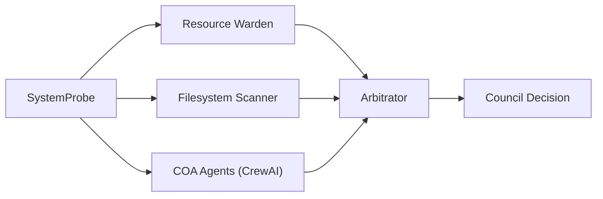
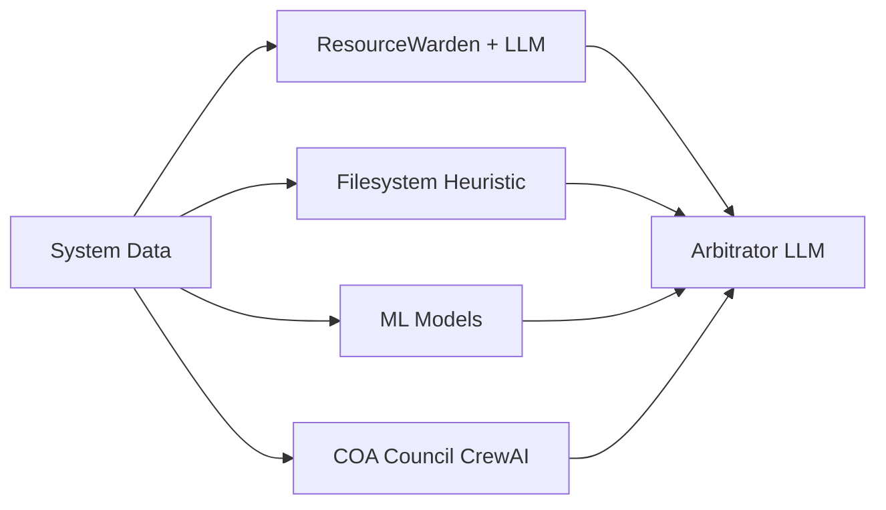

# COA · مركز عمليات أمنية بوكلاء ذكاء اصطناعي

> **ملف عرض تقديمي** — مبني على بنية ملف `Agenticthon_Project_Presentation.pptx`، 12 شريحة جاهزة للسرد.

---

## شريحة 1 — الغلاف

### **هاكاثون وكلاء الذكاء الاصطناعي · Agenticthon 2026**

**اسم المشروع:** COA — Council of Agents SOC Console

> **مركز عمليات أمنية محلي بالكامل**، يكتشف التهديدات على جهاز المستخدم باستخدام مجلس من وكلاء الذكاء الاصطناعي يعملون بدون إنترنت.

`Local-first · Multi-Agent · LLM-powered SOC for Endpoints`

---

## شريحة 2 — فريق العمل

| الدور | الاسم |
| ----- | ----- |
| Tech Lead | _اكتب الاسم_ |
| AI / Agents Engineer | _اكتب الاسم_ |
| Frontend Engineer | _اكتب الاسم_ |
| Security Analyst | _اكتب الاسم_ |

**شعار الفريق:** COA — حماية ذكية محلية.

---

## شريحة 3 — التحدي · 01

### الواقع الحالي

- مراكز العمليات الأمنية (SOC) **مكلفة** ومركزية في السحابة.
- الحلول الحالية ترسل بيانات الجهاز لخوادم خارجية ⟶ مشكلة **خصوصية وسيادة بيانات**.
- الفحص التقليدي بـ Antivirus قائم على **توقيعات ثابتة** ⟶ يفشل أمام البرمجيات المُعتَّمة (obfuscated malware).
- المستخدم العادي **لا يمتلك** خبرة لقراءة سجلات النظام أو علاقات العمليات.

### السؤال

> كيف نقدّم **مركز SOC حقيقي** يعمل **محلياً 100%** بدون إنترنت، ويفهم النظام بعمق، ويُترجم النتائج لإجراءات واضحة لأي مستخدم؟

---

## شريحة 4 — الفكرة · 02

### مجلس من الوكلاء (Council of Agents)

بدلاً من موديل واحد يقرّر، نشغّل **عدّة وكلاء ذكاء اصطناعي متخصصين** على نفس الجهاز ويتداولون قبل إصدار الحكم:

- كل وكيل **متخصص** (عمليات، شبكة، ملفات، OT/ICS).
- المُحَكِّم (Arbitrator) يدمج التقارير ويزيل الـ false positives.
- يعمل بـ **Ollama محلي** — لا يخرج بايت واحد للإنترنت.

---

## شريحة 5 — نظرة عامة على الحل

### الفكرة الجوهرية

ثلاث طبقات تحليل تعمل على التوازي على جهاز المستخدم، ثم تتقابل النتائج عند الـ Arbitrator.

| الطبقة | التقنية | الزمن |
| ----- | ------- | ----- |
| Heuristic Rules | قواعد ثابتة (امتدادات، مسارات، أوامر) | < 1 ثانية |
| ML Models | scikit-learn baseline | < 1 ثانية |
| LLM Agents | Qwen 2.5 + DeepSeek-R1 عبر Ollama | 5–60 ثانية |

### المستخدم المستهدف

- مهندسو الأمن السيبراني (SOC Analysts).
- مالكو الأجهزة الحساسة (مكاتب حكومية، باحثون، صحفيون).
- شركات تتعامل مع بيانات لا يجب أن تغادر الجهاز.

### القيمة المضافة

1. **محلي 100%** — لا سحابة، لا API خارجي.
2. **شرح إجراءات** — كل تهديد له تفسير وسبب تصنيف من LLM.
3. **سجل قابل للتدقيق** — Audit log موقّع.
4. **واجهة عربية موحّدة** بطابع SOC حديث (Bento + Sidebar).

### دور الوكلاء الذكيين

- **Resource Warden** — يراقب العمليات والذاكرة.
- **Arbitrator** — قائد المجلس، يقرّر النتيجة النهائية.
- **COA Council (CrewAI)** — فريق متعدد الأدوار للتحليل العميق.
- **Defense Context Analyzer** — يربط النتائج بسياق دفاعي.
- **ICS Specialist** — متخصص ببيئات OT/SCADA.
- **Incident Reporter** — يصيغ التقارير.

---

## شريحة 6 — المميزات الرئيسية

| الميزة | الوصف |
| ------ | ----- |
| **فحص سريع** | 10 ثوانٍ — فحص ملفات heuristic فقط |
| **فحص عميق** | LLM + Agents + ML — تحليل كل ملف مشبوه على حدة |
| **Risk Score حي** | حلقة تقدّم (٪) محسوبة من توزيع شدّة التهديدات |
| **Bento Dashboard** | KPI + سجل آخر 8 فحوصات (يُحفظ محلياً) |
| **Sidebar SOC** | تنقّل بين Dashboard / Scan / Council / COA / النتيجة |
| **نقاط حالة LLM** | متصل / يفحص / مفصول — تحديث آلي كل 30 ثانية |
| **سجل تدقيق موقَّع** | كل عملية لها audit event مع تحقّق التوقيع عند البدء |
| **تنزيل تقارير** | TXT / HTML / Incident / MITRE Navigator |
| **حماية false positives** | Trust Manager + Behavioral Baseline + قواعد Dev tools |

---

## شريحة 7 — خطوات العمل

### الخطوة الأولى — جمع البيانات

`SystemProbe` يجمع بدون root:

- العمليات النشطة (PID, parent, command-line, CPU%, memory).
- اتصالات الشبكة (IP, port, state).
- الملفات في مجلدات حساسة (Downloads, /tmp, AppData).

### الخطوة الثانية — التحليل المتوازي

- كل وكيل ينتج `Finding` بـ `threat_level` و`confidence`.
- الـ Arbitrator يطبّق:
  - Multi-agent agreement → +0.2 boost.
  - Single-agent low-conf → suppress.
  - Trust Manager → استبعاد العمليات الموقّعة من Microsoft/Apple.

### الخطوة الثالثة — العرض والاستجابة

- لوحة معلومات بـ Risk Score و KPIs.
- صفحة نتيجة بتفاصيل: filesystem_scan + deep_file_analysis + threats[].
- زر تنزيل التقارير، زر اختبار LLM، سجل فحوصات قابل للمسح.

---

## شريحة 8 — التقنيات المستخدمة

### 01 — نموذج الذكاء الاصطناعي

- **Qwen 2.5 7B Instruct** (Q5_K_M) — primary، عبر Ollama.
- **DeepSeek R1 7B** — reasoning عميق.
- **nomic-embed-text** — embeddings للـ RAG.

### 02 — إطار الوكلاء

- **LangGraph** — تنسيق Council multi-agent (FastAPI side).
- **CrewAI** — فريق COA متعدد الأدوار.
- **LangChain** — أدوات + memory + ChatOllama.

### 03 — الواجهة الأمامية

- **React 18 + TypeScript** + **Vite**.
- **CSS منفصل** بنمط Sidebar SOC + Bento Cards.
- **localStorage** لسجل الفحوصات.
- **RTL** بالكامل، خط Cairo + Inter + JetBrains Mono.

### 04 — الخلفية والبنية

- **FastAPI** (Council, port 8765) + **Flask** (COA, port 5050).
- **Pydantic v2** schemas صارمة + self-correction loop.
- **scikit-learn** للـ ML Models.
- **SQLite + aiosqlite** للـ persistence و audit log.
- **ChromaDB** للـ vector store.
- **psutil** + **pywin32** (Windows) لجمع البيانات.
- **Resilience**: Circuit Breaker + Retry + Timeout + Heuristic Fallback.

---

## شريحة 9 — التأثير والقيمة

### مقاييس قابلة للقياس

| المقياس | القيمة | المصدر |
| ------- | ------ | ------ |
| **F1 لموديل الشبكة** | **99.5%** | CIC-IDS2018 (78 ميزة، 250k صف) |
| **F1 لموديل الذاكرة** | **99.1%** | CIC-MalMem-2022 (55 ميزة، 58k صف) |
| **زمن الفحص السريع** | **10 ثوانٍ** | filesystem + heuristic |
| **زمن الفحص العميق** | **30–90 ثانية** | LLM + Agent على 8 ملفات |
| **خصوصية البيانات** | **100% محلي** | لا API خارجي |
| **عدد الوكلاء النشطين** | **6+** | 2 Council + 4 COA |

### القيمة الاجتماعية

- يحمي المستخدم العادي بدون نقل بياناته للسحابة.
- يقلّل تكلفة SOC على المؤسسات الصغيرة بدرجة كبيرة.
- يدعم العربية في الـ rationale ⟶ يفتح المجال لمستخدمين غير ناطقين بالإنجليزية.

---

## شريحة 10 — عرض حي

### سيناريو العرض المباشر

1. تشغيل المنصّة: `make dev` (يفتح FastAPI 8765 + Flask 5050 + Vite 5173).
2. فتح `http://127.0.0.1:5173` ⟶ Sidebar SOC أخضر.
3. **Dashboard**: Risk Score 0% (لا فحص بعد).
4. الانتقال لـ **فحص النظام** ⟶ اختيار «فحص عميق» ⟶ ضغط الزر الكبير.
5. مشاهدة العدّاد المباشر ينمو (`جاري الفحص…  12.4 ث`).
6. تلقائياً تنتقل الواجهة إلى **النتيجة** بعد الانتهاء.
7. عرض:
   - **Result Summary**: العنوان · الوضع · المدّة · Scan ID.
   - **Filesystem Scan**: عدد الملفات المفحوصة + المشبوهة.
   - **Deep File Analysis**: لكل ملف Verdict من LLM (مشبوه/آمن).
8. العودة لـ **Dashboard** ⟶ ملاحظة تحديث Risk Score و KPIs والسجل.
9. الانتقال لـ **أدوات COA** ⟶ تشغيل فحص COA كامل ⟶ مشاهدة `analysis.threats[]` بالعربية.

---

## شريحة 11 — تعريف المشكلة

> **«Antivirus وحده لا يكفي. السحابة لا تمنحنا الخصوصية. والمستخدم لا يفهم سجلات النظام.»**

نقاط الألم:

- **Antivirus** يعتمد على signatures ثابتة ⟶ يفشل ضد malware جديد أو معتّم.
- **EDR السحابي** يكلّف الشركات الصغيرة أكثر من قدرتها، ويتطلب رفع البيانات.
- **سجلات النظام (Event Viewer)** غير قابلة للقراءة لمن ليس مهندس أمن.
- **مرة واحدة فحص** غير كافٍ — التهديدات تطوّر بسرعة.

---

## شريحة 12 — الفريق · الحدث

### الحدث

**Agenticthon 2026** — هاكاثون وكلاء الذكاء الاصطناعي.

### الفريق

- _اكتب الاسم_ — Tech Lead
- _اكتب الاسم_ — AI Engineer
- _اكتب الاسم_ — Frontend
- _اكتب الاسم_ — Security Analyst

### روابط المشروع

- المستودع: [github.com/iksasa15/ccopp](https://github.com/iksasa15/ccopp)
- المستودع التابع: [github.com/iksasa15/COA](https://github.com/iksasa15/COA)
- ملف التشغيل: [RUN.md](RUN.md)
- ملف الموديلات والوكلاء: [MODELS_AND_AGENTS.md](MODELS_AND_AGENTS.md)

---

## ملاحظات للعرض المباشر

- ابدأ من الـ **Dashboard** فارغاً، ثم اشرح القيمة قبل الفحص.
- استخدم **الفحص العميق** لإظهار LLM يعمل (تظهر بطاقة `deep_file_analysis`).
- اشرح أن **الـ Risk Score** محسوب من توزيع الشدّة وليس مؤشراً ثابتاً.
- اعرض **سجل الفحوصات** لإظهار أن النظام يتذكّر النتائج بين الجلسات.
- في النهاية، انقر **«تنزيل reports/html»** لإثبات وجود تقارير قابلة للمشاركة.

---

> أعدّ بالاعتماد على بنية `Agenticthon_Project_Presentation.pptx` (12 شريحة) مع محتوى المشروع الفعلي.
